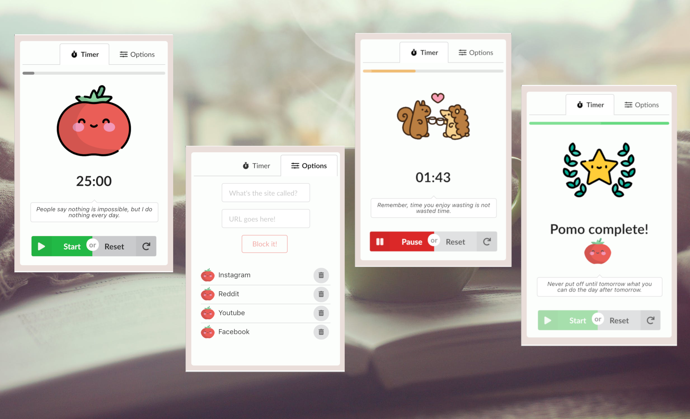
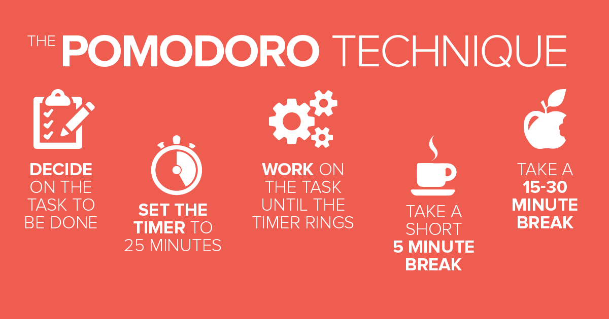

<p align="center">
  
</p>

---

[](https://opensource.org/licenses/mit-license.php)

Pomo is an adorably lightweight productivity timer that blocks distracting websites while you work.

## Table of contents

- [Screenshots](#screenshots)
- [Motivation](#motivation)
- [Getting started](#getting-started)
- [Installation](#installation)
- [Tech Stack](#tech-stack)
- [Author](#author)
- [License](#license)

## Screenshots

<p align="center">

</p>

## Motivation

<p align="center">

</p>

## Getting started

Apart from the regular aspects: Git, Node, Npm, you need to configure Chrome to load unpacked extensions:

  
  
* Navigate to chrome://extensions/ in your browser
* Click on the toggle button on the top right-hand corner to allow "Developer mode"

## Installation

1. Clone this repo and enter
   ```bash
     git clone https://github.com/momentmuse/
     cd pomo-extension
   ```
2. Install dependencies

   ```bash
   cd client
   npm install
   ```

3. Load unpacked extension. Navigate to the extensions page, and click load unpacked on the top left corner.

4. Navigate to the pomo-extension repo and select the "build" folder

5. Refresh the browser, and start focusing!

6. Enjoy the app and provide us with feedback!

## Tech stack

- [React](https://reactjs.org/)
- [Semantic UI](https://react.semantic-ui.com/)

## Author

Amy Kirasack - [GitHub](https://github.com/momentmuse) - [LinkedIn](https://www.linkedin.com/in/amy-kirasack/)

## License

Icons courtesy of [Freepik](https://www.flaticon.com/authors/freepik) at FlatIcon.
This project is licensed under the MIT License - see the [LICENSE](https://github.com/cherlin/trash-walk-backend/blob/develop/LICENSE) file for detail
